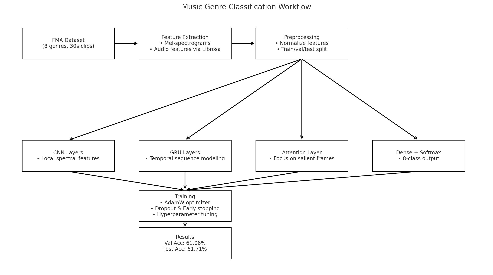

# **Music Genre Classification**

  

## **Overview**

  

This project addresses the **short-segment music genre classification** problem, which is fundamental for **personalized music recommendation systems** and critical to audio service providers. We propose a **CNN–GRU–Attention hybrid model** that integrates convolutional feature extraction, temporal modeling, and an attention mechanism to improve classification accuracy.

  

On the **FMA (Free Music Archive)** dataset, our best model achieves:

- **Validation Accuracy:** 61.06%
    
- **Testing Accuracy:** 61.71%
    
    for an **8-genre classification task**, outperforming baseline models and demonstrating its effectiveness for music recommendation pipelines.
    


## **Dataset**

  

We use the **FMA (Free Music Archive) Small** dataset ([mdeff/fma](https://github.com/mdeff/fma)), containing:

- **Genres:** 8 classes
    
- **Clips:** Short audio segments (30s)
    
- **Format:** .mp3
    
- **Features Extracted:** Mel-spectrograms and related audio features for model input.
    

## **Workflow**


## **Methods**

  

### **1. Baseline Models**

  

We experimented with standard architectures for audio classification:

- **CNN-only** for spatial feature extraction
    
- **GRU-only** for temporal dependencies
    
- **CNN + GRU** hybrid for combined benefits
    

  

### **2. Proposed Model: CNN–GRU–Attention**

  

Our final model architecture:

1. **CNN layers:** Extract local spectral-temporal features from Mel-spectrograms.
    
2. **GRU layers:** Capture sequential dependencies over time.
    
3. **Attention layer:** Learn to focus on informative time steps for genre discrimination.
    
4. **Dense output layer:** Softmax activation for 8-class classification.
    

  

### **3. Training & Hyperparameter Tuning**

- Optimizer: AdamW ([Decoupled Weight Decay Regularization](https://arxiv.org/abs/1711.05101))
    
- Learning rate scheduling
    
- Batch size selection per [Raschka (2022)](https://sebastianraschka.com/blog/2022/batch-size-2.html)
    
- Dropout regularization
    
- Early stopping based on validation accuracy
    


## **Results**

|**Model**|**Val Acc (%)**|**Test Acc (%)**|
|---|---|---|
|CNN|~54|~53|
|GRU|~50|~49|
|CNN + GRU|~57|~56|
|**CNN–GRU–Attention**|**61.06**|**61.71**|

**Key Takeaways:**

- CNN captures local spectral patterns well.
    
- GRU adds temporal modeling capability.
    
- Attention boosts performance by focusing on salient segments.
    


## Project Structure

.
├── 0-feature extraction/
│   ├── 000002_mel_spectrogram.png
│   ├── Dataset.py
│   ├── Feature.py
│   └── log.txt
├── 1-model selection/
│   ├── Basic CNN-GRU/
│   │   ├── Basic Model.py
│   │   ├── Basic Model.txt
│   │   ├── cnn_gru_model_20250807_234024_best.pth
│   │   └── cnn_gru_model_20250807_234024_history.json
│   ├── HybridTest.py
│   ├── model comparison.txt
│   └── structure.html
├── 2-batch size/
│   ├── grid_search_results_20250806_190931.json
│   ├── grid_search_summary_20250806_190931.csv
│   └── viz.png
├── 3-learning rate/
│   ├── CNN-GRU-LRSearch.py
│   ├── grid_search_results_20250808_144645.json
│   └── viz.png
├── 4-optimizer/
│   ├── Optimizer/
│   │   ├── AdamW.py
│   │   ├── cnn_gru_model_20250808_225347_best.pth
│   │   ├── cnn_gru_model_20250808_225347_history.json
│   │   └── log.txt
│   └── Scheduler/
│       ├── AdamW-Scheduler.py
│       ├── cnn_gru_model_20250809_002212_best.pth
│       ├── cnn_gru_model_20250809_002212_history.json
│       └── log.txt
├── 5-tuning/
│   ├── CNN-GRU-Search.py
│   ├── json file corrupted due to system crush
│   ├── log.txt
│   └── top3.png
├── 6-final model/
│   ├── Final CNN-GRU.py
│   ├── cm.png
│   ├── cnn_gru_model_20250809_163418_best.pth
│   ├── cnn_gru_model_20250809_163418_results.json
│   └── log.txt
├── README.md
└── workflow_forcast.png


## **Requirements**

- Python 3.9+
    
- numpy
    
- pandas
    
- scikit-learn
    
- librosa
    
- torch
    
- torchaudio
    
- matplotlib
    

  

Install dependencies:

```
pip install -r requirements.txt
```


## **Usage**

1. **Preprocess Dataset**
    

```
python src/preprocess.py
```

2. **Train Model**
    

```
python src/train.py --model cnn_gru_attn
```

3. **Evaluate Model**
    

```
python src/evaluate.py --model cnn_gru_attn
```


## **References**

1. M. Defferrard et al., _FMA: A Dataset for Music Analysis_, arXiv:1612.01840, 2016.
    
2. H. Bahuleyan, _Music Genre Classification using Machine Learning Techniques_, arXiv:1804.01149, 2018.
    
3. S. Raschka, _No, we don’t have to choose batch sizes as powers of 2_, 2022.
    
4. A. G. Howard et al., _MobileNets: Efficient Convolutional Neural Networks for Mobile Vision Applications_, arXiv:1704.04861, 2017.
    
5. I. Loshchilov and F. Hutter, _Decoupled Weight Decay Regularization_, arXiv:1711.05101, 2017.
    


